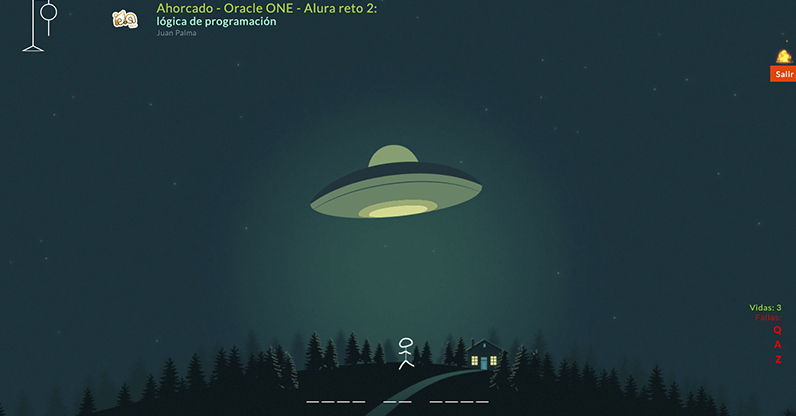

Oracle Alura Reto 2 - Ahorcado - Logica de programación
===================

### Ver el sitio web:
https://ahorcado.idalibre.com

Es mi version de ahorcado con tematica Ovni en el que se construye el requisito usando canvas como lo solicita el reto y un poco de lo que el timpo y la imaginacion me ha permitido.
Este reto permite incoporar mas palabras para el juego al igual que otras categorias.
Cuenta con sonidos de ambiente que puden ser desahbilitados desde los settings del juego.
Cuenta con indicadores graficos a manera de destellos asi como sonoros de los errores o aciertos, los misos se despliegan en pantalla al mosar las letras acertadas en las casillas o las letras erronesa en el lateral y si te encuentras en la version movil adicinoal a esto tu teclado mostrara en verde o rojo los acerito y fallos.
es completamente responsive.
Tambien es posible instalar el luego en tu dispositivo y poder usarlo sin coneccion. 

Un toque personal
-----------------
La aplicacion cuenta con algunas animaciones propias, y con algunas funciones adicionales para darle un toque personal y para seguir divirtiendonos y aprender el proceso. 

espero que les guste :)

## Un poco de mi como persona:

### Redes Sociales:
- [Instagram](https://www.instagram.com/juan_palma/)
- [Facebook](https://www.facebook.com/juan.palma.v)
- [TikTok](https://www.tiktok.com/@juan.palma)

## Un poco de mi en lo laboral:
### Redes Sociales:
Diseño grafico - [Instagram](https://www.instagram.com/id.a_libre/)

19.75 Studio: Fotografia Social - [web](https://1975studio.com)

Obscuro Placer: Fotografia Erotica - [web](https:obscuroplacer.com)
